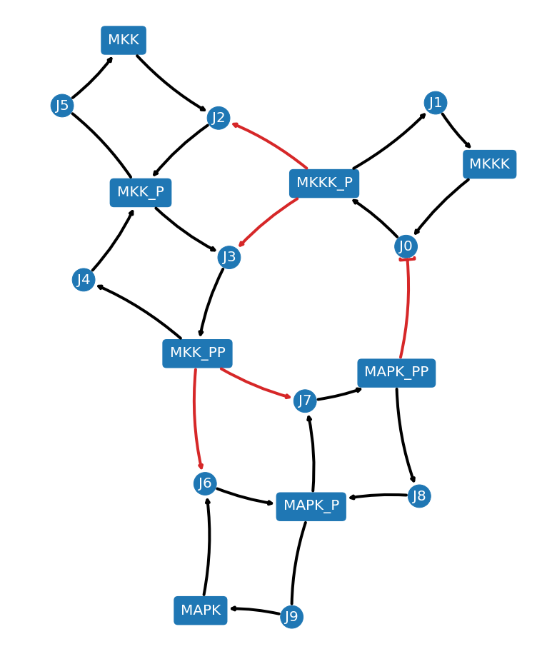
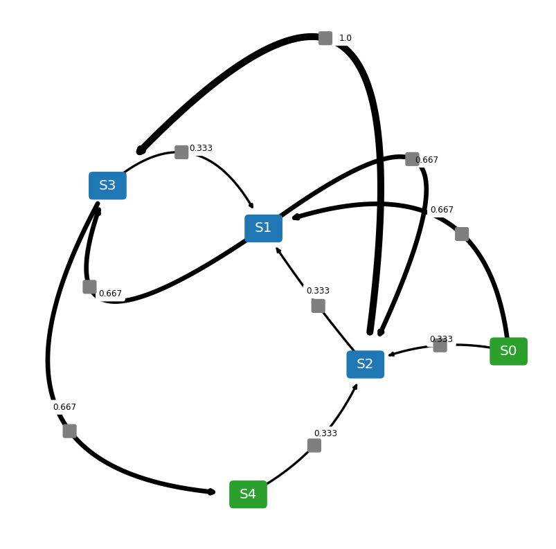

.. NetworkEX documentation master file, created by
   sphinx-quickstart on Thu Nov  8 15:04:29 2018.
   You can adapt this file completely to your liking, but it should at least
   contain the root `toctree` directive.

Welcome to NetworkEX's documentation!
=====================================

NetworkEX is a simple extension to `NetworkX<https://networkx.github.io/>`_ and `matplotlib<https://matplotlib.org/>`_ to draw reaction network diagrams from SBML or Antimony strings with ease. NetworkEX also supports drawing weighted reaction network diagrams from an ensemble of models based on reaction frequency or user-supplied weights.

    
.. toctree::
   :maxdepth: 10
   
   installation.rst
   start.rst
   examples.rst
   API.rst

Indices and tables
==================

* :ref:`genindex`
* :ref:`modindex`
* :ref:`search`

.. highlight:: python
