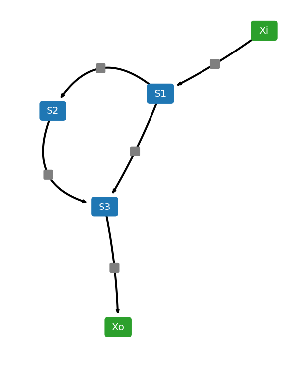
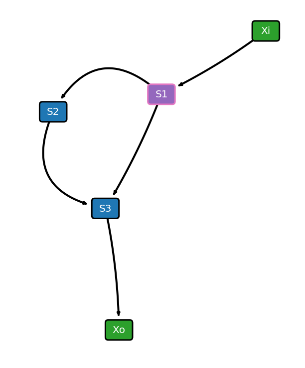

===========
Quick Start
===========

To start using NetworkEX, `install the package using pip<https://networkex.readthedocs.io/en/latest/installation.html>`_ or use `Tellurium<http://tellurium.analogmachine.org/>`_. 

Simple Example
--------------

This section demonstrates how to load in a model and draw network diagrams. To start with, lets import networkex package and define a model. Here, we use a simple feed forward loop as an example.

.. code-block:: python

    import networkex as nex

    AntimonyStr = '''
    $Xi -> S1; k0*Xi
    S1 -> S2; k1*S1
    S2 -> S3; k2*S2
    S1 -> S3; k3*S1
    S3 -> $Xo; k4*S3

    Xi = 3; Xo = 2
    k0 = 0.46; k1 = 0.73; k2 = 0.64;
    k3 = 0.51; k4 = 0.22
    '''
    
Next, create an NetworkEX object.

.. code-block:: python

    net = nex.NetworkEX(AntimonyStr)
    
To generate network diagrams, simply run `draw()<https://networkex.readthedocs.io/en/latest/API.html#networkex.NetworkEX.draw>`_.

.. code-block:: python

    net.draw()

Advanced Configuration
----------------------

NetworkEX object has various properties for configuring the network diagram. 

- scale: scaling factor for layout algorithm
- fontsize: fontsize for labels
- edgelw: linewidth of edges
- nodeColor: node color
- reactionNodeColor: reaction node color
- labelColor: label color
- reactionColor: edge color
- modifierColor: modifier edge color
- boundaryColor: boundary node color
- nodeEdgeColor: node edge color
- nodeEdgelw: linewidth of node edges
- highlight: list of species ids or reaction ids to highlight
- hlNodeColor: node color of highlighted nodes
- hlNodeEdgeColor: node edge color of highlighted nodes
- drawReactionNode: flag for drawing reaction nodes
- breakBoundary: flag for breaking all boundary species into separate nodes

You can define these properties and run `draw()<https://networkex.readthedocs.io/en/latest/API.html#networkex.NetworkEX.draw>`_ to generate customized network diagrams. For example, by running the following code, you can generate a network diagram with node edges, species S1 highlighted, and reaction nodes removed.

.. code-block:: python

    net.drawReactionNode = False
    net.nodeEdgelw = 3
    net.highlight = ['S1']
    net.draw()

Test Cases
----------

NetworkEX comes with set of test cases. All test cases are available under networkex.testmodels submodule.

