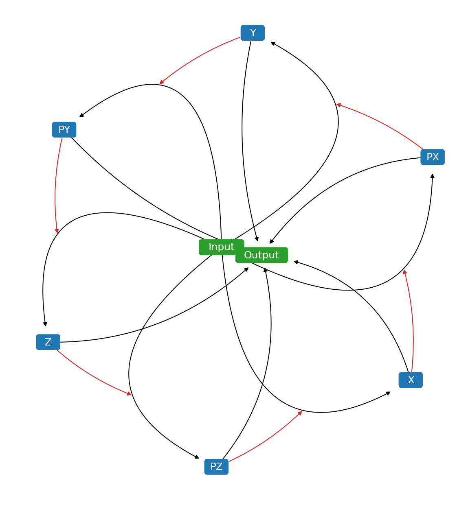
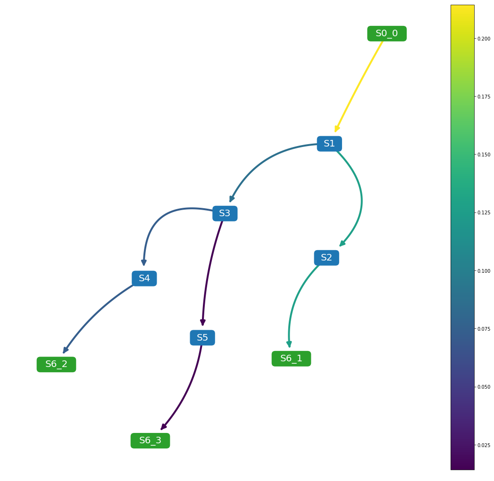
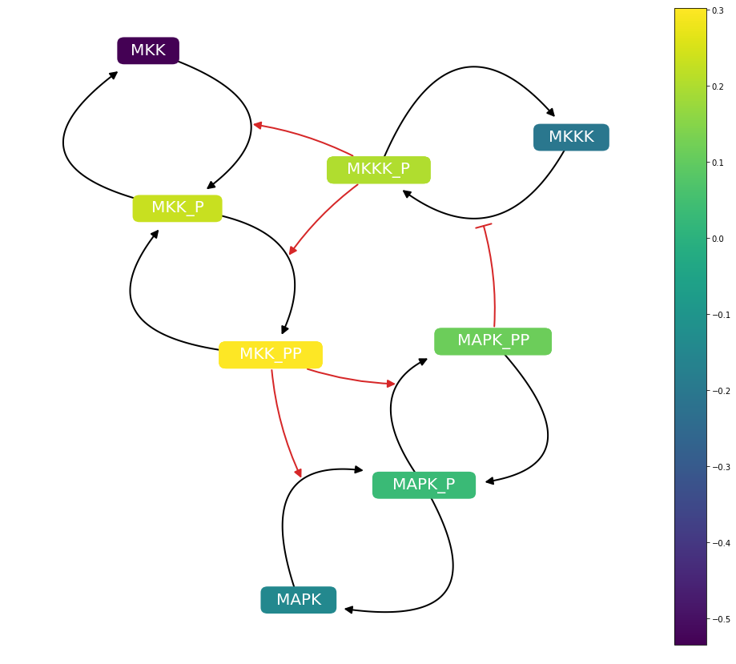
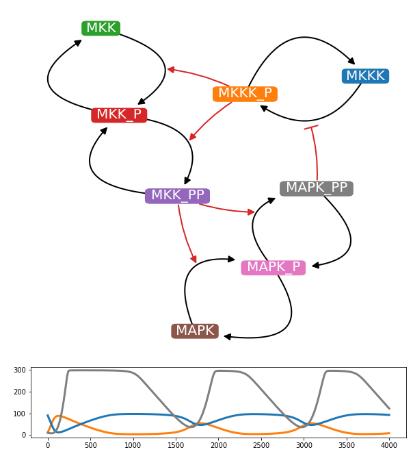
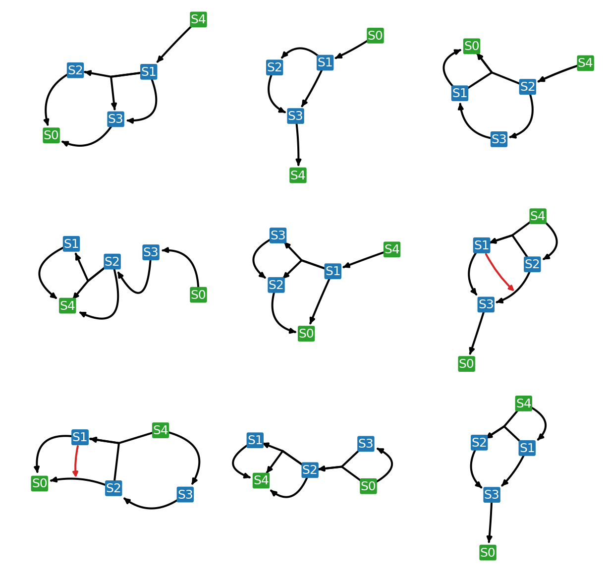
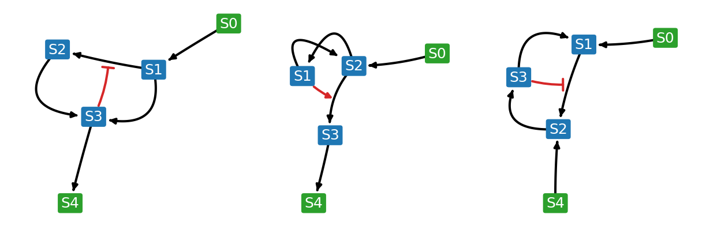
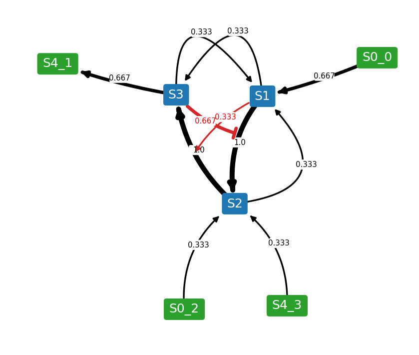
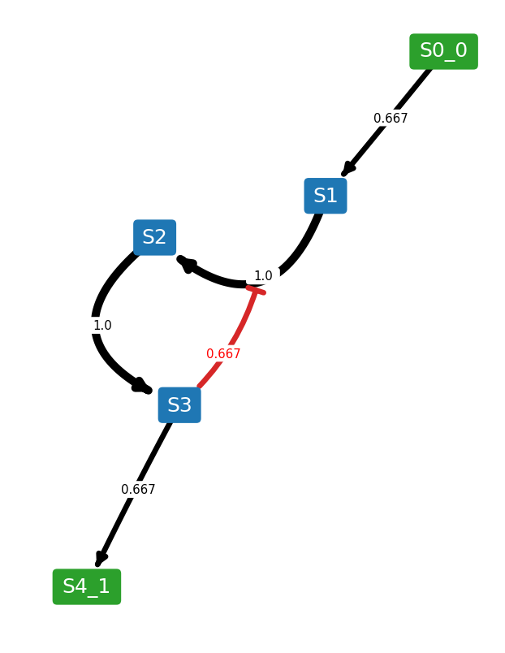
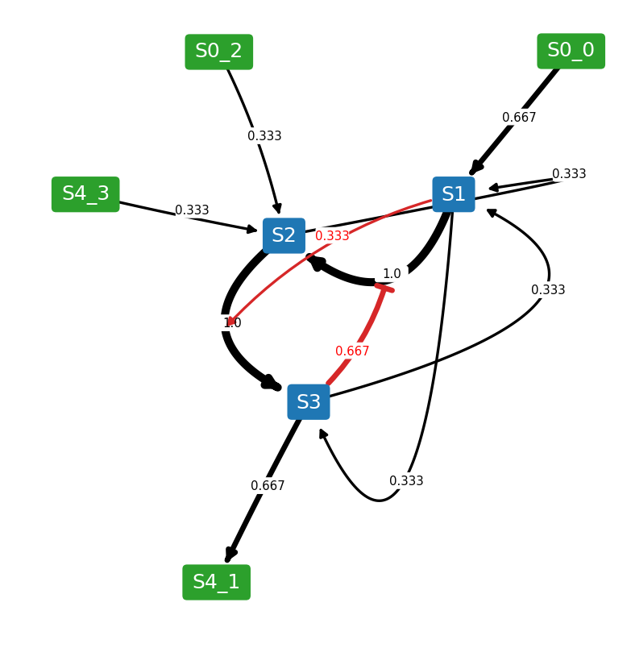

========
Tutorial
========

Network Configuration
----------------------

`Network <https://netplotlib.readthedocs.io/en/latest/API.html#netplotlib.Network>`_ object supports following properties for configuring the network diagram. 

- scale: scaling factor for layout algorithm
- fontsize: fontsize for labels
- edgelw: linewidth of edges
- nodeColor: node color
- reactionNodeColor: reaction node color
- labelColor: label color
- labelReactionIds: boolean flag for labeling reaction ids
- reactionColor: edge color
- modifierColor: modifier edge color
- boundaryColor: boundary node color
- nodeEdgeColor: node edge color
- nodeEdgelw: linewidth of node edges
- highlight: list of species ids or reaction ids to highlight
- hlNodeColor: node color of highlighted nodes
- hlNodeEdgeColor: node edge color of highlighted nodes
- drawReactionNode: boolean flag for drawing reaction nodes
- breakBoundary: boolean flag for breaking all boundary species into separate nodes
- tightLayout: boolean flag for tighter node layout
- analyzeFlux: boolean flag for visualizing flux
- analyzeRates: boolean flag for visualizing species rate of changes
- analyzeColorHigh: color to use for higher values during analysis
- analyzeColorLow: color to use for lower values during analysis
- analyzeColorMap: colormap to use for analysis. 
- analyzeColorScale: boolean flag for using colormaps. Setting this true ignore analyzeColorHigh and analyzeColorLow
- drawInlineTimeCourse: boolean flag for plotting inline time-cource simulation
- simTime: value for simulation duration
- forceAnalysisAtSimTime: boolean flag for running analysis at the end of simTime
- plotColorbar: boolean flag for visualizing color bar
- inlineTimeCourseSelections: list of species to plot for time-course simulation
- customAxis: use custom matplotlib.pyplot.axis object for the diagram
- layoutAlgorithm: specify layout algorithm

You can define these properties and run `draw() <https://netplotlib.readthedocs.io/en/latest/API.html#netplotlib.Network.draw>`_ to generate customized network diagrams. 

Detached Boundary
-----------------

Detach common boundary species by setting `breakBoundary=True`. 

.. code-block:: python

    net = npl.Network(npl.testmodels.REPRESSILATOR)
    net.draw()
    net.breakBoundary = True
    net.draw()

.. image:: ../images/boundary2.png
    :width: 55%

Flux Visualization
------------------

Visualize flux using colormap via setting `analyzeFlux=True`. Set `analyzeColorScale=True` to scale the colormap to minimum and maximum values. You can supply your own colormaps. To plot colorbar, set `plotColorbar=True`.

.. code-block:: python

    net.analyzeColorScale = True
    net.analyzeFlux = True
    net.analyzeColorMap = 'viridis'
    net.plotColorbar = True
    

Rate of Changes Visualization
-----------------------------

Visualize species rates of change using colormap via setting `analyzeRates=True`. Set `analyzeColorScale=True` to scale the colormap to minimum and maximum values. The resulting plot will show species rate of change at t=simTime. You can supply your own colormaps. To plot colorbar, set `plotColorbar=True`.

.. code-block:: python

    net.analyzeColorScale = True
    net.analyzeRates = True
    net.analyzeColorMap = 'viridis'
    net.simTime = 3000
    net.plotColorbar = True
    

Inline Time-course Plot
-----------------------

Plot inline time-course plot along with network diagrams with matching colors by setting `drwaInlineTimeCourse=True`. The simulation runs for t=simTime. You can selection specific species to plot by passing a list to `inlineTimeCourseSelections` property.

.. code-block:: python

    net.drawInlineTimeCourse = True
    net.inlineTimeCourseSelections = ['MKKK_P', 'MKKK', 'MAPK_PP']
    net.simTime = 4000
    

Highlighting
------------

Highlight specific nodes by passing a list to highlight property. Choose the highlight colors using hlNodeColor and hlNodeEdgeColor properties.

.. code-block:: python

    net.drawReactionNode = False
    net.nodeEdgelw = 3
    net.highlight = ['S1']
    net.draw()

.. image:: ../images/ffl_mod.png
    :width: 55%

    
Selecting Layout Algorithm
--------------------------

Currently, netplotlib supports following layout algorithms:

'kamada-kawai'

'spring'

'dot'

'neato'

'twopi'

By default, netplotlib uses Kamada-Kawai layout algorithm. Certain layout algorithms require external graphviz to be configured and pygraphviz package installed.

    
NetworkEnsemble Configuration
-----------------------------

`NetworkEnsemble <https://netplotlib.readthedocs.io/en/latest/API.html#netplotlib.NetworkEnsemble>`_ object supports following properties for configuring the network diagram. 

- scale: scaling factor for layout algorithm
- fontsize: fontsize for labels
- edgelw: linewidth of edges
- nodeColor: node color
- reactionNodeColor: reaction node color
- labelColor: label color
- labelReactionIds: boolean flag for labeling reaction ids
- reactionColor: edge color
- modifierColor: modifier edge color
- boundaryColor: boundary node color
- nodeEdgeColor: node edge color
- nodeEdgelw: linewidth of node edges
- highlight: list of species ids or reaction ids to highlight
- hlNodeColor: node color of highlighted nodes
- hlNodeEdgeColor: node edge color of highlighted nodes
- edgeLabel: boolean flag for displaying edge weights
- edgeLabelFontSize: fontsize of edge weight labels
- drawReactionNode: flag for drawing reaction nodes
- breakBoundary: boolean flag for breaking all boundary species into separate nodes
- weights: list of custom weights to override
- edgeTransparency: boolean flag for changing the transparency of the edges accordin to edge weights
- plottingThreshold: value of threshold to prevent from displaying weighted edges
- removeBelowThreshold: boolean flag for preventing weighted edges below plottingThreshold from displaying
- analyzeFlux: boolean flag for visualizing flux
- customAxis: use custom matplotlib.pyplot.axis object for the diagram
- layoutAlgorithm: specify layout algorithm

Grid Plot
---------

Plot a grid plot of network diagrams of individual models in the list by running `drawNetworkGrid()` function. 

.. code-block:: python

    net.drawNetworkGrid(3, 3)

    

Weighted Network Diagram
------------------------

Combine models in the list and generate a one network diagram where the edges are weighted according to the frequency. To generate a weighted network diagram, run `drawWeightedDiagram()` function. Below are images of an example where an ensemble of three models are combined into a weighted network diagram.

.. code-block:: python

    net.drawWeightedDiagram()

    

It is possible to set a threshold where edges below the threshold are removed from the resulting network diagram. To set a threshold, use `plottingThreshold` and `removeBelowThreshold` properties. For example, if `plottingThreshold=0.5` and `removeBelowThreshold=True`, any edges that appear in less than half of the model ensemble will be ignored. However, sometimes you might want to put the ignored reactions back while keeping the layout. To do so, set `removeBelowThreshold=False` while keeping the `plottingThreshold`. 
    
.. code-block:: python

    net.removeBelowThreshold = True
    net.plottingThreshold = 0.5
    net.drawWeightedDiagram()
    net.removeBelowThreshold = False
    net.drawWeightedDiagram()
    

    

Test Cases
----------

Netplotlib comes with set of test cases. All test cases are available under netplotlib.testmodels submodule.